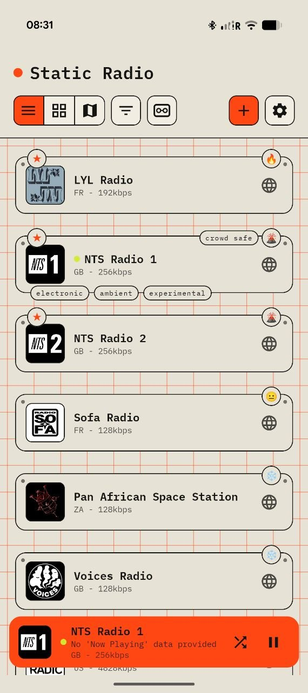
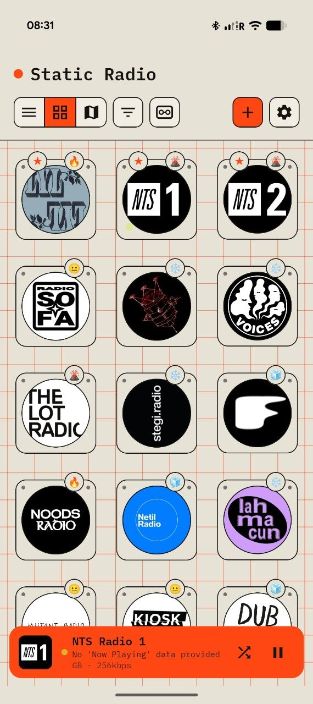
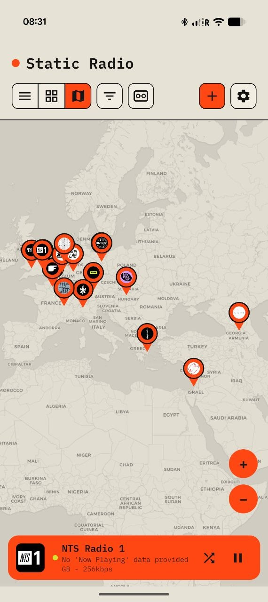
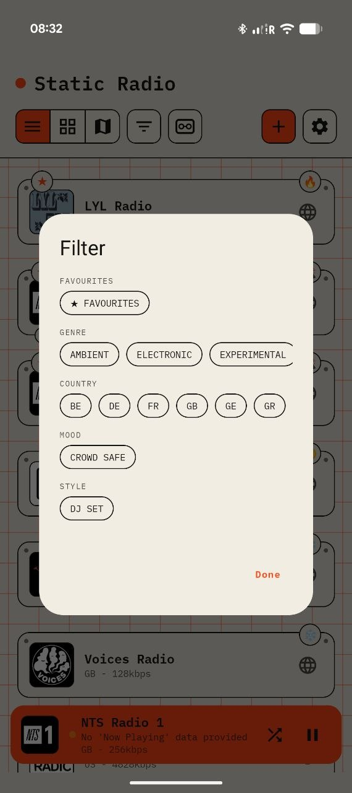
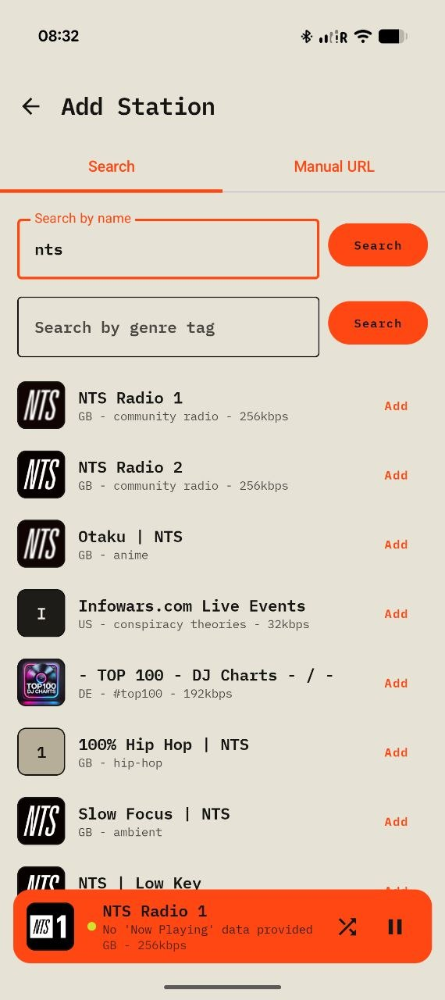
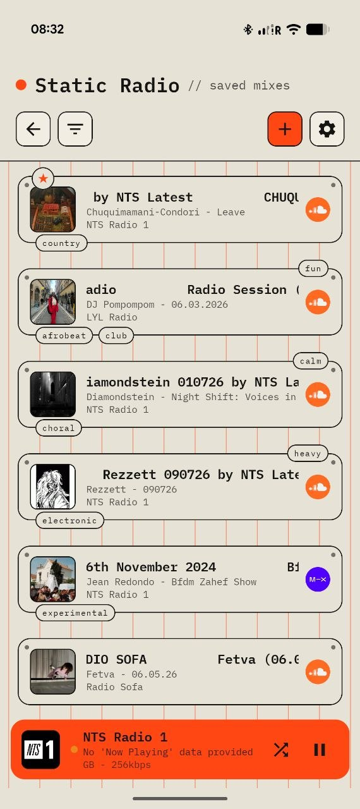

# STATIC

A side-loadable Android internet radio app for stations you actually
curate yourself — no built-in directory, no accounts, no cloud sync.
Everything lives on your device.

Built as a snappier, more personal alternative to apps like Transistor:
add stations by pasting a stream URL or searching Radio Browser, tag them
with your own genre/mood/style vocabulary, place them on a world map, and
bookmark SoundCloud/Mixcloud DJ mixes alongside them.

## Features

- **Add stations** by manual stream URL, Radio Browser name search, or
  Radio Browser genre-tag search
- **List, grid, and map views** of your station collection, with
  favourites, popularity tiers, and live-broadcast time windows
- **User-defined genre/mood/style tags** — not scraped from unreliable
  station metadata
- **Saved Mixes**: bookmark SoundCloud/Mixcloud DJ sets with auto-fetched
  title/artist/artwork, tracklists, and share-to-app support
- **Playback**: Media3/ExoPlayer with software auto-gain (internet radio
  streams carry no loudness metadata), a configurable buffer, and a
  persistent now-playing bar with live ICY metadata
- **Sleep timer**, Android Auto basic playback support
- **Full-fidelity backup/restore** for both stations and mixes (own zip
  format), plus one-way import from Transistor collection exports
- **Post-brutalist Material You** visual style — raw concrete tones, one
  accent color, hard keylines instead of soft shadows

See [PROJECT_CONTEXT.md](PROJECT_CONTEXT.md) for full architecture,
data model, and build details.

## Installing

Grab the latest signed APK from the
[Releases](../../releases) page and side-load it — enable "Install
unknown apps" for whichever app you use to open the APK file.

## Building from source

Requires Android Studio (for the bundled JDK) and the Android SDK.

```
$env:JAVA_HOME = "C:\Program Files\Android\Android Studio\jbr"
.\gradlew.bat :app:assembleDebug --console=plain
```

Output: `app/build/outputs/apk/debug/app-debug.apk`

## Screenshots













## License

MIT — see [LICENSE](LICENSE).

## Support

If you find this useful, consider a [Ko-fi tip](https://ko-fi.com/W4T623HDPA) —
same link as the button in the app's Settings screen.
